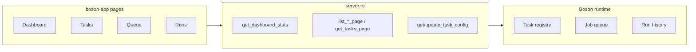

# Boson App UI & Quality Audit

**Audit date:** 2026-06-26  
**Scope:** All Leptos routes and UI components in `boson-app` (24 Rust source files, ~1,915 lines per quality review scan)  
**Reference canon:** Orbital Introduction (`/orbital`), [`.cursor/rules/20-ui-orbital-principles.mdc`](../.cursor/rules/20-ui-orbital-principles.mdc), [`.cursor/rules/21-ui-implementation-patterns.mdc`](../.cursor/rules/21-ui-implementation-patterns.mdc), [`.cursor/rules/31-async-boson-chronon-photon.mdc`](../.cursor/rules/31-async-boson-chronon-photon.mdc), valence-app schema index + help components, [`chronon-app/CHRONON_UI_AUDIT.md`](../chronon-app/CHRONON_UI_AUDIT.md)

---

## Executive summary

Boson-app is **Orbital-first at the shell and page chrome level**: every route uses `ContentContainer`, typography presets (`Title3`, `Subtitle2`, `Body1`, `Caption*`), `Card`/`StatCard`, and `OrbitalInfiniteScroll` for the three main list pages. The app is usable for developers and operators but under-serves less technical readers with no contextual help (`InfoLabel`), no skeleton loading states, hand-rolled tables instead of `DataTable`, and one **broken navigation path** (`/boson/runs?job=`).

| Category | Pass | Violations | High severity |
|---|---:|---:|---:|
| Orbital surfaces & layout | Partial | 11 | 0 |
| Typography & raw HTML | Partial | 9 | 0 |
| Presentation & InfoLabels | Fail | 14 | 0 |
| Async (Suspense/Transition/skeletons) | Partial | 7 | 0 |
| DataTable / charts | Fail | 6 | 0 |
| Code quality (god files, composition, structure) | Partial | 12 | 2 |
| Test IDs | Partial | 1 gap set | 0 |
| **Functional wiring** | Fail | 1 | **1** |

**Top findings:**

1. **High — Broken `?job=` filter:** `JobCard` and `RunInfoGrid` link to `/boson/runs?job={id}`, but [`BosonRunsIndexPage`](src/pages/runs/mod.rs) always calls `list_runs_page(..., None)` and never reads query params — the server API already supports `job_id_filter`.
2. **High — Server god file:** [`server.rs`](src/server.rs) (614 lines) combines DTOs, status mappers, auth helpers, 15 server functions, and Gluon pool integration — blocks testability and maintainability.
3. **Medium — No skeleton loading:** Five routes use `<Card>"Loading..."</Card>` or em-dash `StatCard` placeholders instead of Orbital `Skeleton`/`SkeletonItem`.
4. **Medium — No InfoLabel usage anywhere:** Domain jargon (signature JSON, pool, retry policy, effective vs default priority) lacks the valence-app help pattern.
5. **Medium — Hand-rolled tables and card lists:** Tasks, queue, and runs miss `DataTable` search/filter/list-view affordances ([valence schema index](../valence-app/src/pages/schema_index/components/schema_table/schema_data_table.rs) reference).

**Phased remediation estimate:**

| Phase | Focus | Effort |
|---|---|---|
| P1 | Quick wins (skeletons, test ids, wire `?job=`, cancel UX, dead APIs) | S–M |
| P2 | Help & composition (`BosonHelpCardHeader`, `TaskSummaryPanel`, folder cleanup) | M |
| P3 | DataTable migration (tasks → queue → runs) | M–L |
| P4 | Charts + dashboard series endpoints | M |
| P5 | Async + Photon live updates | M |
| P6 | Server refactor + unit tests | L |
| P7 | Motion polish (optional) | S |

---

## Product surface & access

Boson is the platform UI for **async background work** — registering Boson tasks, monitoring the job queue, inspecting run history, and tuning task configuration (pool, priority, retry policy). Any registered authenticated user can browse; task config updates and job cancellation require **email verification**.

The app today is metadata-heavy (dense cards, monospace signatures, status badges) and assumes familiarity with background-job vocabulary (signature JSON, pool, backoff). Domain jargon (signature, pool, retry policy, effective vs default config) lacks `InfoLabel` coverage — see [InfoLabel rules](#infolabel-rules-concrete) below for where to add it.

---

## Audit methodology & scoring legend

Each route section is scored against four dimensions:

1. **Orbital conformance** — surfaces, layouts, typography, DataTable/charts, raw HTML
2. **Presentation** — purpose, hierarchy, InfoLabels, focus, materials/color
3. **Async** — Suspense vs Transition, skeletons vs spinners, Photon streaming
4. **Code quality** — file size, composition, props, test ids, directory structure

**Severity:**

| Level | Meaning |
|---|---|
| **High** | Broken behavior or blocks maintainability/testing |
| **Medium** | UX inconsistency or missed platform capability |
| **Low** | Polish, minor convention drift |

**Pass criteria:** Explicit evidence cited; "Pass" only when no Medium+ violations in that dimension.

---

## Orbital conformance rules (expanded reference)

These rules are applied consistently across all route audits below.

### Surfaces & elevation

| Context | Expected | Violation signal |
|---|---|---|
| App shell (nav, AppBar) | `UnifiedFieldShellLayout`; nav `NavigationMaterial`; flat shell elevation | Shadow on nav items; hardcoded shell backgrounds |
| Page canvas | Lightest neutral; `ContentContainer` as focus surface | Page-level turf overriding canvas tokens |
| Section content | One `Card` at **Resting** (`--shadow4`) per logical block | Card wrapping Card without hierarchy intent |
| Stat / KPI tiles | `StatCard` (already elevated) — **not** nested inside another Card | Card > StatCard for same section |
| List item tiles | `TaskCard` / `JobCard` each own a Card — acceptable; page should not wrap the whole list in an extra Card | Runs: outer Card + table (OK); tasks/queue: flat card list (OK) |
| Dialogs / overlays | `Dialog` + `DialogSurface` at Modal elevation | Inline overlays |
| Status chips | `Badge` + text label | Color-only status |

**Layering rule:** Canvas (flat) → section Card(s) at Resting → emphasis via typography and badges, not nested Cards. At most one Raised emphasis per viewport region.

### Layouts

| Component | Use when |
|---|---|
| `ContentContainer` | Every page (max-width centering) |
| `Flex vertical + SpacingSize::Size240` | Page section stack |
| `Flex justify=SpaceBetween` | Title + primary action row |
| `Stack` / `Grid` / `GridConfig` | Form fields, metadata grids |
| `AutoGrid` | Fluid card walls (task index card list) |
| `Table` + scroll wrapper | Wide tabular data (runs, recent tasks) |
| `OrbitalInfiniteScroll` | Server-paged lists |

### Typography

| Role | Preset |
|---|---|
| Page title | `Title3` |
| Section header | `Subtitle2` |
| Body | `Body1` |
| Metadata / timestamps | `Caption1` / `Caption2` |
| Form labels | `Label` + `FormHint`; domain fields add `InfoLabel` |
| Monospace (signatures, errors) | `Text tag=TextTag::Code` or `TextFont::Monospace` |

### DataTable vs hand-rolled Table

When a list has **search**, **multi-filter**, **sort**, **column help**, or **list/card view toggle**, prefer `DataTable` with optional `DataTableFeatures::LIST_VIEW` (valence schema index pattern). Boson currently uses hand-rolled `Table` or infinite-scroll card lists everywhere.

Reference: [`schema_data_table.rs`](../valence-app/src/pages/schema_index/components/schema_table/schema_data_table.rs).

### Charts

Use `orbital-charts` (`LineChart`, `BarChart`, `AreaChart`) when time-series or categorical aggregates aid scanning. Requires server series data — `DashboardStats` today is point-in-time counts only.

Reference: [`valence-app/src/pages/dashboard/charts.rs`](../valence-app/src/pages/dashboard/charts.rs).

### InfoLabel rules (concrete)

Mirror valence [`ValenceHelpCardHeader`](../valence-app/src/components/help/card_header.rs):

| Apply InfoLabel when | Boson examples |
|---|---|
| Section title with domain jargon | "Retry Policy", "Basic Configuration", "Recent Tasks" |
| Table column with non-obvious semantics | Attempt, Duration, Success Rate, Effective vs Default |
| Form field needing format guidance | Pool, priority scale, backoff multiplier, max delay |
| Status needing disambiguation | Queued vs Running vs Failed vs Canceled |
| Metric needing scope | "Runs (24h)" — UTC window clarification |
| Empty state next step | "No tasks" → explain `#[boson::task]` registration |

Do **not** InfoLabel every `Label` — only domain-specific or operational fields.

### Async rules

| Scenario | Mechanism |
|---|---|
| Initial SSR load | `Suspense` + `Skeleton`/`SkeletonItem` |
| Refetch / pagination / filter change | `Transition` + skeleton (avoid full-page flash) |
| Button in-flight | Disabled + label change ("Saving…", "Cancelling…") |
| Long lists | `OrbitalInfiniteScroll` with empty/end slots |
| Live status while user watches | Photon `#[photon::synced]` + client subscribe (counter-app pattern) |

Per [`.cursor/rules/21-ui-implementation-patterns.mdc`](../.cursor/rules/21-ui-implementation-patterns.mdc): use `<Transition>` for resources that refetch; `<Suspense>` for one-shot initial load.

### Motion

Use `OrbitalPresence` + `PresenceMotion` for expand/collapse, dialog enter/exit, filter panel reveal. Respect `use_reduced_motion()`. Decorative motion is optional polish (Phase 7).

---

## Full component inventory

### Routes (7 pages + 3 shell wrappers)

| Route | Component | File(s) | Lines |
|---|---|---|---:|
| `/boson` | `BosonRootPage` | `pages/dashboard/mod.rs` + `quick_links.rs`, `recent_tasks_table.rs` | 72 + 38 + 104 |
| `/boson/tasks` | `BosonTasksIndexPage` | `pages/tasks/mod.rs` + `task_card.rs` | 70 + 101 |
| `/boson/tasks/:task_name` | `BosonTaskDetailPage` | `pages/task_detail.rs` | 97 |
| `/boson/tasks/:task_name/config` | `BosonVerifiedTaskConfigPage` → `BosonTaskConfigPage` | `lib.rs` (guard), `pages/task_config/*` | 85 + 202 + 77 + 60 |
| `/boson/queue` | `BosonQueuePage` | `pages/queue/mod.rs` + `job_card.rs`, `queue_filters.rs` | 97 + 70 + 17 |
| `/boson/runs` | `BosonRunsIndexPage` | `pages/runs/mod.rs` + `runs_table.rs` | 70 + 50 |
| `/boson/runs/:id` | `BosonRunDetailPage` | `pages/run_detail/mod.rs` + `run_info_grid.rs`, `run_error_display.rs` | 80 + 56 + 13 |

**Shell:** `BosonLayout` ([`layout.rs`](src/layout.rs)), `BosonAuthGuard`, `BosonVerifiedTaskConfigPage`, `BosonRoutes` ([`lib.rs`](src/lib.rs))

### Shared components (`src/components/`)

| Component | File | Props | Lines |
|---|---|---:|---:|
| `JobStatusBadge` | `job_status_badge.rs` | 1 (`status`) | 20 |
| `RunStatusBadge` | `run_status_badge.rs` | 1 (`status`) | 20 |

### Feature components by route area

**Dashboard**

| Component | File | Props | Lines |
|---|---|---:|---:|
| `QuickLinks` | `dashboard/quick_links.rs` | 0 | 38 |
| `RecentTasksTable` | `dashboard/recent_tasks_table.rs` | 1 (`tasks_res`) | 104 |

**Tasks**

| Component | File | Props | Lines |
|---|---|---:|---:|
| `TaskCard` | `tasks/task_card.rs` | 1 (`task`) | 101 |

**Task config**

| Component | File | Props | Lines |
|---|---|---:|---:|
| `TaskConfigForm` | `task_config/basic_config_form.rs` | 3 | 77 |
| `RetryPolicyForm` | `task_config/retry_policy_form.rs` | 4 | 60 |

**Queue**

| Component | File | Props | Lines |
|---|---|---:|---:|
| `QueueFilters` | `queue/queue_filters.rs` | 1 (`status_str`) | 17 |
| `JobCard` | `queue/job_card.rs` | 2 (`job`, `on_cancel`) | 70 |

**Runs**

| Component | File | Props | Lines |
|---|---|---:|---:|
| `BosonRunRow` | `runs/runs_table.rs` | 1 (`run`) | 50 |

**Run detail**

| Component | File | Props | Lines |
|---|---|---:|---:|
| `RunInfoGrid` | `run_detail/run_info_grid.rs` | 1 (`run`) | 56 |
| `RunErrorDisplay` | `run_detail/run_error_display.rs` | 1 (`message`) | 13 |

### Orbital / integration imports (categorized)

| Category | Components / APIs | Used in |
|---|---|---|
| **Layout chrome** | `ContentContainer`, `UnifiedFieldShellLayout`, `ShellAppBar`, `ShellLeftNav`, `UnifiedFieldAppBar`, `Navigation*`, `StatCard` | All pages, `layout.rs` |
| **Surfaces** | `Card` | Widespread; no explicit `Material` on content cards |
| **Typography** | `Title3`, `Subtitle2`, `Body1`, `Body1Strong`, `Caption1/2`, `Text`, `TextFont` | All pages |
| **Controls** | `Input`, `Select`, `Button`, `Label`, `FormHint`, `MessageBar` | Forms, queue filter, actions |
| **Data display** | `Table*`, `Badge`, `EmptyState`, `OrbitalInfiniteScroll*` | Runs, dashboard, lists |
| **Auth** | `RequireAuthenticated` | `lib.rs` route guards |
| **Not used** | `DataTable`, `InfoLabel`, `Skeleton`, `Transition`, `orbital_charts`, `OrbitalPresence`, `AutoGrid` | — |

### Non-UI modules (quality section only)

| Module | File | Lines | Role |
|---|---|---:|---|
| `server` | `server.rs` | 614 | DTOs + 15 server functions + Gluon pool query |

### God-file / size flags (>200 lines)

| File | Lines | Verdict |
|---|---:|---|
| `server.rs` | 614 | **Server god file** — split into `dto.rs`, `server/dashboard.rs`, `server/tasks.rs`, `server/jobs.rs`, `server/runs.rs` |
| `task_config/mod.rs` | 202 | **Borderline UI god file** — page + 10 signals + 6 Effects + save handler; extract form state module |

### Turf usage inventory (10 files)

| File | Classes | Classification |
|---|---|---|
| `task_detail.rs` | `.BackLink`, `.Meta`, `.MetaMono` | Token-aligned color; raw `font-family: monospace` — typography violation |
| `run_detail/mod.rs` | `.BackLink` | Duplicated link styling |
| `task_config/mod.rs` | `.BackLink` | Duplicated link styling |
| `recent_tasks_table.rs` | `.Table`, `.Row`, `.Link`, `.Count` | Token hover; table row pattern |
| `runs_table.rs` | `.Row`, `.Link` | Duplicated row/link pattern |
| `runs/mod.rs` | `.Card`, `.Table` | Legacy Thaw Card width override comment |
| `tasks/mod.rs` | `.SearchBox` | Layout constraint — acceptable |
| `task_card.rs` | `.Meta`, `.MetaSecondary`, `.Actions` | Token color; raw monospace |
| `job_card.rs` | `.JobMeta` | Token color — OK |
| `run_info_grid.rs` | `.Label`, `.Link` | Token color — OK |

---

## Route audits

### Shell — `BosonLayout`, routes, auth

**Files:** [`layout.rs`](src/layout.rs), [`lib.rs`](src/lib.rs)

#### Purpose

Provides the Unified Field shell (AppBar + left nav) and route/auth wiring for all Boson pages. Every route renders inside this shell. Task config route adds email-verification guard via `BosonVerifiedTaskConfigPage`.

#### Orbital conformance

| Check | Result | Evidence |
|---|---|---|
| Shell layout | **Pass** | `UnifiedFieldShellLayout`, `ShellAppBar`, `ShellLeftNav`, `Navigation` |
| Flat shell elevation | **Pass** | `NavigationMaterial` slot; delegated to orbital-integrations |
| Navigation | **Pass** | `NavigationLink` with icons; Leptos router paths via `paths::*` |
| Page canvas | **Pass** | `<Outlet />` renders into shell main area |

**Raw HTML:** Single wrapper `
` — acceptable for E2E.

#### Presentation

| Check | Result | Notes |
|---|---|---|
| Nav labels | **Pass** | Dashboard, Tasks, Queue, Runs — clear ops vocabulary |
| App identity | **Pass** | `UnifiedFieldAppBar` with app name from `AppMetadata` |
| Section help | **N/A** | Shell only |

#### Async

**Pass** — shell is static; no data loading.

#### Code quality

| Check | Result | Notes |
|---|---|---|
| File size | **Pass** | `layout.rs` 44 lines; `lib.rs` 85 lines |
| Props | **Pass** | 0 props on layout and guards |
| Test IDs | **Pass** | Root + 4 nav links (`test_id` on `NavigationLink`) |

#### Violations

| ID | File | Severity | Rule | Finding |
|---|---|---|---|---|
| — | — | — | — | No violations |

#### Recommendations

1. Consider a brief first-visit hint on the dashboard explaining Boson's role for general users (presentation, not shell change). **[P2]**

---

### `/boson` — Dashboard

**Files:** [`pages/dashboard/mod.rs`](src/pages/dashboard/mod.rs), [`quick_links.rs`](src/pages/dashboard/quick_links.rs), [`recent_tasks_table.rs`](src/pages/dashboard/recent_tasks_table.rs)

#### Purpose

**Purpose:** At-a-glance background-work health — task count, queue depth, running jobs, and 24h run volume, plus shortcuts and a snapshot of recent tasks.

**Primary tasks:** (1) Scan KPIs, (2) jump to Tasks/Queue/Runs, (3) click through to a task from the recent table.

**Hierarchy:** Title + subtitle → stat cards → quick links → recent tasks table. **Focus** is correctly on the KPI row first.

**Actions:** Quick link buttons and "View All" on recent tasks — acceptable secondary navigation.

#### Orbital conformance

| Check | Result | Evidence |
|---|---|---|
| `ContentContainer` | **Pass** | `data_testid="boson-dashboard"` |
| Section spacing | **Pass** | `Flex vertical gap=Size240` |
| Typography | **Pass** | `Title3` + `Subtitle2` page header |
| Surfaces | **Pass** | `StatCard` tiles (not nested in Card) + one `Card` for recent table + one `Card` for quick links; no card-in-card |
| Layout | **Pass** | `Flex wrap` for stats; `Table` in `Card` |
| DataTable | **Miss** | Hand-rolled recent tasks table — no search/filter |
| Charts | **Miss** | Count tiles only; no trend visualization |
| Raw HTML | **Pass** | Turf on table rows only; token-backed hover |

#### Presentation

| Check | Result | Notes |
|---|---|---|
| KPI labels | **Partial** | StatCard labels clear; no InfoLabel explaining "Runs (24h)" scope (UTC 24h window per server) |
| Page subtitle | **Partial** | "Background work management" — terse for general users |
| Recent tasks section | **Partial** | No intro text; "Recent Tasks" is not defined (top 5 by sort order, not recency) |
| Status accessibility | **N/A** | No status on dashboard |
| Empty recent tasks | **Gap** | Table renders empty body when zero tasks — no `EmptyState` |

#### Async

| Section | Current | Expected | Verdict |
|---|---|---|---|
| Stats grid | `Suspense` + em-dash `StatCard` fallback | `Suspense` + `Skeleton`/`StatCard`-shaped skeleton | **Fail** |
| Recent tasks | `Suspense` + `"Loading..."` Card | `Suspense` + table skeleton rows | **Fail** |
| Refetch | None | N/A today | **Pass** |
| Live KPIs | Static resource | Photon/polling for queue/running counts | **Gap (P5)** |

#### Code quality

| Check | Result | Notes |
|---|---|---|
| Page orchestrator | **Pass** | 72 lines — thin composition |
| `RecentTasksTable` props | **Pass** | 1 prop (`tasks_res`) |
| Double fetch | **Low** | `get_dashboard_stats` and `get_tasks` each scan all jobs/runs via `usize::MAX` |
| Test IDs | **Partial** | Page only; no stat card or table row hooks |

#### Violations

| ID | File | Severity | Rule | Finding |
|---|---|---|---|---|
| D-01 | `dashboard/mod.rs` L26–60 | Medium | Async / Skeleton | Stats fallback uses em-dash `StatCard`s, not `Skeleton` |
| D-02 | `dashboard/recent_tasks_table.rs` L52, L99 | Medium | Async / Skeleton | `"Loading..."` Card fallback |
| D-03 | `dashboard/mod.rs` | Medium | Charts | KPI-only; no run/queue trend despite ops scanning need |
| D-04 | `dashboard/recent_tasks_table.rs` | Medium | DataTable | Hand-rolled table; fixed top-5 slice, mislabeled "Recent" |
| D-05 | `dashboard/mod.rs` L15–16 | Low | Server perf | Duplicate full-list scans (`get_dashboard_stats` + `get_tasks`) |
| D-06 | `dashboard/mod.rs` | Low | InfoLabel | "Runs (24h)" lacks scope hint (UTC) |
| D-07 | `dashboard/recent_tasks_table.rs` | Low | Presentation | No empty state when task list is empty |
| D-08 | `dashboard/*` | Low | Test IDs | No hooks on stat cards, quick links, or table rows |

#### Recommendations

1. Replace stat fallback with `SkeletonItem` rows matching `StatCard` layout (valence dashboard pattern). **[P1]**
2. Add `RecentTasksTableSkeleton` with `SkeletonItem` table rows (counter-app `HighScoresSkeletonRows` pattern). **[P1]**
3. Add `EmptyState` inside recent tasks `Card` when `top_tasks` is empty. **[P1]**
4. Add InfoLabel on "Runs (24h)" clarifying UTC 24-hour window. **[P2]**
5. Rename section to "Tasks Overview" or sort by activity if true recency is intended. **[P2]**
6. **P4:** Add `get_run_stats_series()` server fn + `LineChart` for success/failure over time.
7. **P5:** Photon subscription or polling for live queue/running stat cards.

---

### `/boson/tasks` — Tasks index

**Files:** [`pages/tasks/mod.rs`](src/pages/tasks/mod.rs), [`task_card.rs`](src/pages/tasks/task_card.rs)

#### Purpose

**Purpose:** Browse all registered Boson tasks with effective config, queue depth, run stats, and navigation to detail/config/queue/runs.

**Primary tasks:** (1) Find a task via search, (2) open task detail or config, (3) jump to queue/runs for a task.

**Hierarchy:** Title → search input → infinite card list. **Focus** on search + first visible cards — correct.

**Actions:** Per-card View/Configure/View Queue/View Runs — appropriate secondary placement.

#### Orbital conformance

| Check | Result | Evidence |
|---|---|---|
| `ContentContainer` | **Pass** | `data_testid="boson-tasks"` |
| Layout | **Pass** | `Flex vertical`, `OrbitalInfiniteScroll` |
| Typography | **Partial** | Page `Title3` OK; `TaskCard` uses turf monospace for signature |
| Surfaces | **Pass** | Each `TaskCard` owns a `Card`; no outer Card wrapper |
| DataTable | **Fail** | Card list + basic search — missing `DataTable` LIST_VIEW, column filters |
| AutoGrid | **Note** | Vertical Flex + cards works; `AutoGrid` could improve responsive walls |
| Raw HTML | **Partial** | Wrapper `
` for search width + testid on card wrapper |

#### Presentation

| Check | Result | Notes |
|---|---|---|
| Search affordance | **Pass** | Placeholder "Search tasks..." |
| Task metadata | **Partial** | "Signature", "Effective", "Defaults" unexplained for general users |
| Empty state | **Pass** | `EmptyState` with `#[boson::task]` hint |
| Card actions | **Partial** | Four subtle buttons — dense; no primary CTA hierarchy |

#### Async

| Section | Current | Expected | Verdict |
|---|---|---|---|
| Initial load | Infinite scroll (no Suspense at page level) | OK for scroll component | **Pass** |
| Search refetch | Full remount of `OrbitalInfiniteScroll` on query change | `Transition` + skeleton overlay | **Fail** |
| End of list | `Caption1` end view | OK | **Pass** |

#### Code quality

| Check | Result | Notes |
|---|---|---|
| Page size | **Pass** | 70 lines |
| `TaskCard` | **Pass** | 101 lines, single concern |
| Props | **Pass** | 0 page, 1 card |
| Nav boilerplate | **Low** | `use_navigate` + `StoredValue` duplicated |
| Test IDs | **Partial** | Per-task `data-testid="task-{name}"`; no search input hook |

#### Violations

| ID | File | Severity | Rule | Finding |
|---|---|---|---|---|
| T-01 | `tasks/mod.rs` L31–66 | Medium | Async / Transition | Search remounts infinite scroll without `Transition` |
| T-02 | `tasks/mod.rs` | Medium | DataTable | Hand-rolled card list; missing LIST_VIEW toggle, column sort |
| T-03 | `tasks/task_card.rs` L38–55 | Low | Typography | Turf `.Meta` with `font-family: monospace` instead of `TextTag::Code` |
| T-04 | `tasks/task_card.rs` | Medium | Presentation | No InfoLabel on Signature, Effective, Defaults fields |
| T-05 | `tasks/mod.rs` L27–28 | Low | Test IDs | Search input wrapper lacks `data-testid` |
| T-06 | `tasks/task_card.rs` | Low | Test IDs | Action buttons lack wrappers |

#### Recommendations

1. Wrap search-driven list in `<Transition>` with card-list skeleton fallback. **[P1]**
2. Add `data-testid="tasks-search"` on search wrapper div. **[P1]**
3. **P3:** Migrate to `DataTable` with `LIST_VIEW` (valence schema pattern); card view as primary, table toggle secondary.
4. Extract shared `TaskSummaryPanel` used by `TaskCard` and task detail. **[P2]**
5. Replace turf monospace with `Text tag=TextTag::Code` for signature line. **[P2]**

---

### `/boson/tasks/:task_name` — Task detail

**Files:** [`pages/task_detail.rs`](src/pages/task_detail.rs)

#### Purpose

**Purpose:** Inspect a single task's signature, effective/default config, and aggregate stats before configuring or tracing queue/runs.

**Primary tasks:** (1) Read task metadata, (2) open config, (3) jump to queue/runs.

**Hierarchy:** Back link + title → single Card with metadata + actions. **Focus** on the card content — acceptable for a detail page.

**Actions:** Configure (Primary) + View Queue/Runs (Subtle) — correct emphasis.

#### Orbital conformance

| Check | Result | Evidence |
|---|---|---|
| `ContentContainer` | **Pass** | `data_testid="boson-task-detail"` |
| Typography | **Partial** | `Title3` OK; turf `.MetaMono` for signature |
| Surfaces | **Pass** | Single `Card` for content |
| Layout | **Partial** | Back link + title in one row — no `SpaceBetween` action row |
| DataTable / Charts | **N/A** | Detail page |
| Raw HTML | **Partial** | Turf `.BackLink` on router `A` |

#### Presentation

| Check | Result | Notes |
|---|---|---|
| Metadata clarity | **Partial** | Same fields as `TaskCard` but no section headers or InfoLabels |
| Error/not-found | **Pass** | `MessageBar` Warning/Error |
| Duplication | **Fail** | ~90% overlap with `TaskCard` view markup |

#### Async

| Section | Current | Expected | Verdict |
|---|---|---|---|
| Task load | `Suspense` + `"Loading..."` Card | `Suspense` + metadata skeleton | **Fail** |
| Refetch | None | N/A | **Pass** |

#### Code quality

| Check | Result | Notes |
|---|---|---|
| File location | **Low** | Single file at `pages/task_detail.rs` — siblings use subfolders |
| File size | **Pass** | 97 lines |
| Duplication | **Medium** | Metadata + actions duplicated from `TaskCard` |
| Back link CSS | **Medium** | `.BackLink` turf duplicated in 3 files |
| Test IDs | **Partial** | Page only |

#### Violations

| ID | File | Severity | Rule | Finding |
|---|---|---|---|---|
| TD-01 | `task_detail.rs` L54, L91 | Medium | Async / Skeleton | `"Loading..."` Card fallback |
| TD-02 | `task_detail.rs` L32–43 | Medium | Composition | Duplicated `.BackLink` turf (also in run_detail, task_config) |
| TD-03 | `task_detail.rs` L62–82 | Medium | Composition | Duplicates `TaskCard` metadata/actions — no shared panel |
| TD-04 | `task_detail.rs` L38–41 | Low | Typography | Turf monospace for signature |
| TD-05 | `task_detail.rs` | Low | Directory | Not in `pages/task_detail/mod.rs` subfolder |
| TD-06 | `task_detail.rs` | Low | Presentation | No InfoLabels on domain fields |
| TD-07 | `task_detail.rs` | Low | Test IDs | Action buttons lack wrappers |

#### Recommendations

1. Extract shared `BosonBackLink` component (or orbital link pattern) — replace 3 duplicated turf blocks. **[P1]**
2. Extract `TaskSummaryPanel` from `TaskCard` + task detail. **[P2]**
3. Add task detail skeleton matching metadata grid layout. **[P1]**
4. Move to `pages/task_detail/mod.rs` for directory consistency. **[P2]**
5. Add InfoLabels on Signature, Effective vs Defaults. **[P2]**

---

### `/boson/tasks/:task_name/config` — Task config

**Files:** [`pages/task_config/mod.rs`](src/pages/task_config/mod.rs), [`basic_config_form.rs`](src/pages/task_config/basic_config_form.rs), [`retry_policy_form.rs`](src/pages/task_config/retry_policy_form.rs)

#### Purpose

**Purpose:** Edit per-task routing (pool, priority) and retry policy. Requires email verification.

**Primary tasks:** (1) Select pool from Gluon virtual pools, (2) set priority, (3) tune retry parameters and save.

**Hierarchy:** Back link → title → Basic Config card → Retry Policy card → error bar → Cancel/Save. **Focus** on form cards — correct.

**Actions:** Save (Primary, disabled while pending) + Cancel (Subtle) — correct placement at bottom.

#### Orbital conformance

| Check | Result | Evidence |
|---|---|---|
| `ContentContainer` | **Pass** | `data_testid="boson-task-config"` |
| Form structure | **Pass** | Two `Card` sections via subcomponents |
| Controls | **Partial** | Orbital `Input`/`Label`/`FormHint` on basic form; raw `<select>` when pools exist |
| Typography | **Pass** | `Subtitle2` section headers |
| Surfaces | **Pass** | Two sibling Cards — no nesting |
| Raw HTML | **Fail** | Raw `<select>`/`<option>` in `basic_config_form.rs` L34–48 |

#### Presentation

| Check | Result | Notes |
|---|---|---|
| Pool picker | **Partial** | Gluon pool detail in `FormHint` — good; no InfoLabel on Pool concept |
| Priority hint | **Pass** | `FormHint` explains lower = higher priority |
| Retry fields | **Partial** | Labels only — no hints on backoff, max delay semantics |
| Save feedback | **Pass** | "Saving..." label + disabled state |
| Error display | **Pass** | `MessageBar` on save failure |

#### Async

| Section | Current | Expected | Verdict |
|---|---|---|---|
| Config + pools load | `Suspense` + `"Loading..."` Card | Form skeleton matching two cards | **Fail** |
| Save action | `save_pending` disables button | OK | **Pass** |
| Post-save | `config_res.refetch()` | OK | **Pass** |

#### Code quality

| Check | Result | Notes |
|---|---|---|
| God file | **Medium** | `mod.rs` 202 lines: 10 RwSignals, 6 Effects, save handler, view |
| Form components | **Pass** | `TaskConfigForm` 3 props; `RetryPolicyForm` 4 props |
| Stale comment | **Low** | L54 references "Thaw Input binding" — outdated |
| Test IDs | **Partial** | Page only; no field or save button hooks |

#### Violations

| ID | File | Severity | Rule | Finding |
|---|---|---|---|---|
| TC-01 | `task_config/mod.rs` | Medium | God file | 202 lines mixing page, state, effects, save, view |
| TC-02 | `task_config/mod.rs` L157, L196 | Medium | Async / Skeleton | `"Loading..."` Card fallback |
| TC-03 | `basic_config_form.rs` L34–48 | Medium | Raw HTML | Raw `<select>` when Gluon pools available; `queue_filters.rs` uses Orbital `Select` |
| TC-04 | `retry_policy_form.rs` | Medium | Presentation | No `FormHint` or InfoLabel on retry fields |
| TC-05 | `task_config/mod.rs` L54 | Low | Stale comment | "Thaw Input binding" — use Orbital `Input`/`bind` wording |
| TC-06 | `task_config/mod.rs` L139–145 | Medium | Composition | Duplicated `.BackLink` turf |
| TC-07 | `task_config/*` | Low | Test IDs | Form fields and save button lack wrappers |

#### Recommendations

1. Replace raw `<select>` with Orbital `Select` + `SelectBind` (match `queue_filters.rs`). **[P1]**
2. Add form skeleton (two card-shaped skeleton blocks). **[P1]**
3. Extract `use_task_config_form` hook/module from `mod.rs` (signals, effects, save). **[P2]**
4. Add `BosonHelpCardHeader` on "Basic Configuration" and "Retry Policy" with InfoLabel popovers. **[P2]**
5. Add `FormHint` on backoff multiplier and max delay fields. **[P2]**
6. Add test IDs: `task-config-save`, `task-config-pool`, `task-config-priority`. **[P1]**

---

### `/boson/queue` — Queue

**Files:** [`pages/queue/mod.rs`](src/pages/queue/mod.rs), [`queue_filters.rs`](src/pages/queue/queue_filters.rs), [`job_card.rs`](src/pages/queue/job_card.rs)

#### Purpose

**Purpose:** Monitor enqueued and running jobs; filter by status; cancel pending jobs; navigate to related runs.

**Primary tasks:** (1) Filter queue by status, (2) cancel queued/running jobs, (3) view runs for a job.

**Hierarchy:** Title → status filter → infinite card list. **Focus** on filter + first jobs — correct for ops.

**Actions:** Cancel on eligible jobs; View Runs — appropriate per-card placement.

#### Orbital conformance

| Check | Result | Evidence |
|---|---|---|
| `ContentContainer` | **Pass** | `data_testid="boson-queue"` |
| Filter | **Pass** | Orbital `Select` in `QueueFilters` |
| List | **Pass** | `OrbitalInfiniteScroll` + `JobCard` tiles |
| Surfaces | **Pass** | Each job owns a Card |
| DataTable | **Fail** | Card list — no table view, no multi-filter |
| Status badges | **Pass** | `JobStatusBadge` text + color |

#### Presentation

| Check | Result | Notes |
|---|---|---|
| Filter labels | **Partial** | Select options clear; no label explaining filter scope |
| Job metadata | **Partial** | Pool/priority/enqueued shown; no InfoLabels |
| Cancel affordance | **Partial** | Cancel button visible but no in-flight disabled state |
| Empty state | **Pass** | `EmptyState` with guidance |

#### Async

| Section | Current | Expected | Verdict |
|---|---|---|---|
| Initial load | Infinite scroll | OK | **Pass** |
| Filter refetch | Full remount on `status_filter` / `trigger_refetch` | `Transition` + skeleton | **Fail** |
| Cancel action | `cancel_pending` HashSet tracked in page | Pass `cancel_pending` to `JobCard`; disable + "Cancelling…" | **Fail** |
| Live updates | Static fetch | Photon for job status changes while page open | **Gap (P5)** |

#### Code quality

| Check | Result | Notes |
|---|---|---|
| Page size | **Pass** | 97 lines |
| `JobCard` props | **Pass** | 2 props |
| Cancel wiring | **Medium** | `cancel_pending` not passed to `JobCard` |
| Test IDs | **Fail** | No hooks on filter, job cards, or cancel buttons |

#### Violations

| ID | File | Severity | Rule | Finding |
|---|---|---|---|---|
| Q-01 | `queue/mod.rs` L55–93 | Medium | Async / Transition | Filter/cancel remounts scroll without `Transition` |
| Q-02 | `queue/mod.rs` L29–46 | Medium | Async / Button | `cancel_pending` tracked but not passed to `JobCard` |
| Q-03 | `queue/mod.rs` | Medium | DataTable | Card list only; no search, sort, or list/table toggle |
| Q-04 | `queue/job_card.rs` L45 | **High** | Functional wiring | "View Runs" navigates to `?job=` — broken on runs page (see B-F01) |
| Q-05 | `queue/*` | Low | Presentation | No InfoLabel on Pool, Priority in job cards |
| Q-06 | `queue/*` | Low | Test IDs | No `data-testid` on filter, cards, cancel |

#### Recommendations

1. Wire `cancel_pending` into `JobCard`; disable Cancel + show "Cancelling…" while in set. **[P1]**
2. Fix runs page `?job=` filter (see B-F01) so View Runs links work. **[P1]**
3. Wrap filter-driven list in `<Transition>` with job-card skeletons. **[P1]**
4. Add test IDs: `queue-status-filter`, `job-card-{id}`, `job-cancel-{id}`. **[P1]**
5. **P3:** DataTable with status filter integration and LIST_VIEW.
6. **P5:** Photon subscription for live job status on queue page.

---

### `/boson/runs` — Runs index

**Files:** [`pages/runs/mod.rs`](src/pages/runs/mod.rs), [`runs_table.rs`](src/pages/runs/runs_table.rs)

#### Purpose

**Purpose:** Browse run history with status, timing, and attempt metadata; navigate to run detail.

**Primary tasks:** (1) Scan runs, (2) filter by job (intended via `?job=` links), (3) open run detail.

**Hierarchy:** Title → table in Card with infinite scroll. **Focus** on table — correct for ops scanning.

**Actions:** Row click → run detail — correct.

#### Orbital conformance

| Check | Result | Evidence |
|---|---|---|
| `ContentContainer` | **Pass** | `data_testid="boson-runs"` |
| Table | **Partial** | Orbital `Table` + `BosonRunRow`; turf row hover |
| Surfaces | **Pass** | Single outer `Card` wrapping table |
| DataTable | **Fail** | No search, filter toolbar, column help, or list view |
| Turf | **Low** | Card width override comment references legacy Thaw defaults |

#### Presentation

| Check | Result | Notes |
|---|---|---|
| Column headers | **Partial** | Attempt, Duration unexplained for general users |
| Empty state | **Pass** | `EmptyState` in scroll empty slot |
| Status | **Pass** | `RunStatusBadge` text + color |
| Job filter | **Fail** | API supports `job_id_filter`; UI never reads query string |

#### Async

| Section | Current | Expected | Verdict |
|---|---|---|---|
| Initial load | Infinite scroll | OK | **Pass** |
| Filter by job | **Broken** | Read `?job=` from URL; pass to `list_runs_page` | **Fail** |
| Refetch | Static closure | `Transition` when filter wired | **Note** |
| Live status | Static | Photon for running runs | **Gap (P5)** |

#### Code quality

| Check | Result | Notes |
|---|---|---|
| Page size | **Pass** | 70 lines |
| `BosonRunRow` | **Pass** | 50 lines, extracted row component |
| Row/link turf | **Low** | Duplicated with `recent_tasks_table.rs` |
| Test IDs | **Fail** | No row hooks |

#### Violations

| ID | File | Severity | Rule | Finding |
|---|---|---|---|---|
| B-F01 | `runs/mod.rs` L13 | **High** | Functional wiring | `list_runs_page(offset, limit, None)` — ignores `?job=` query param linked from queue/run detail |
| R-01 | `runs/mod.rs` | Medium | DataTable | Hand-rolled table; strongest DataTable migration candidate |
| R-02 | `runs/mod.rs` L15–18 | Low | Turf | Legacy Thaw Card width comment |
| R-03 | `runs/runs_table.rs` | Low | Composition | Duplicated row hover/link turf pattern |
| R-04 | `runs/*` | Low | Presentation | No InfoLabel on Attempt, Duration columns |
| R-05 | `runs/*` | Low | Test IDs | No `runs-row-{id}` hooks |

#### Recommendations

1. **P1:** Read `job` query param via `use_query_map()` (or equivalent); pass to `list_runs_page`; show active filter chip with clear action.
2. **P3:** Migrate to `DataTable` with job/task/status filters and column InfoLabels.
3. Extract shared `ClickableTableRow` or table link styles to `components/`. **[P2]**
4. Add `data-testid` on each `BosonRunRow` wrapper. **[P1]**

---

### `/boson/runs/:id` — Run detail

**Files:** [`pages/run_detail/mod.rs`](src/pages/run_detail/mod.rs), [`run_info_grid.rs`](src/pages/run_detail/run_info_grid.rs), [`run_error_display.rs`](src/pages/run_detail/run_error_display.rs)

#### Purpose

**Purpose:** Inspect a single run's metadata, status, timing, and error output for troubleshooting.

**Primary tasks:** (1) Read run/job/task linkage, (2) review error message if failed, (3) navigate to filtered runs for the job.

**Hierarchy:** Back link + title → Card with metadata grid + optional error bar. **Focus** on grid + error — correct.

**Actions:** Job ID link to filtered runs — intended but broken (B-F01).

#### Orbital conformance

| Check | Result | Evidence |
|---|---|---|
| `ContentContainer` | **Pass** | `data_testid="boson-run-detail"` |
| Grid layout | **Pass** | `Grid` + `GridConfig::with_gaps(2, 24, 8)` in `RunInfoGrid` |
| Typography | **Pass** | `Caption2` labels + `Body1` values |
| Error display | **Pass** | `RunErrorDisplay` uses `TextFont::Monospace` in `MessageBar` — canonical pattern |
| Surfaces | **Pass** | Single Card wrapping grid + error |
| Raw HTML | **Partial** | Turf `.BackLink`, `.Link` on router `A` |

#### Presentation

| Check | Result | Notes |
|---|---|---|
| Metadata labels | **Partial** | Grid labels clear; Attempt/Duration lack InfoLabels |
| Error surfacing | **Pass** | Dedicated error `MessageBar` with monospace text |
| Job link | **Partial** | Links to broken `?job=` filter |
| Not-found | **Pass** | Warning `MessageBar` |

#### Async

| Section | Current | Expected | Verdict |
|---|---|---|---|
| Run load | `Suspense` + `"Loading..."` Card | Metadata grid skeleton | **Fail** |
| Live status | Static | Photon while status = Running | **Gap (P5)** |

#### Code quality

| Check | Result | Notes |
|---|---|---|
| Composition | **Pass** | Page 80 lines; grid and error extracted |
| `RunInfoGrid` | **Pass** | 56 lines, 1 prop |
| `RunErrorDisplay` | **Pass** | 13 lines — exemplar for monospace errors |
| Back link CSS | **Medium** | Duplicated `.BackLink` turf |
| Test IDs | **Partial** | Page only |

#### Violations

| ID | File | Severity | Rule | Finding |
|---|---|---|---|---|
| RD-01 | `run_detail/mod.rs` L55, L74 | Medium | Async / Skeleton | `"Loading..."` Card fallback |
| RD-02 | `run_detail/mod.rs` L36–41 | Medium | Composition | Duplicated `.BackLink` turf |
| RD-03 | `run_info_grid.rs` L13 | **High** | Functional wiring | Job link to `?job=` — broken on runs index (B-F01) |
| RD-04 | `run_info_grid.rs` | Low | Presentation | No InfoLabel on Attempt, Duration |
| RD-05 | `run_detail/*` | Low | Test IDs | No hooks on grid fields or back link |

#### Recommendations

1. Add metadata grid skeleton (label/value row placeholders). **[P1]**
2. Use shared `BosonBackLink` component. **[P1]**
3. Fix B-F01 so job link works. **[P1]**
4. Add InfoLabels on Attempt (retry count) and Duration (ms vs human-readable). **[P2]**
5. **P5:** Photon subscription to refresh run status while Running.
6. **P7:** `OrbitalPresence` slide for error block reveal.

---

## Cross-cutting findings

### Duplication hotspots

| Pattern | Files | Recommendation |
|---|---|---|
| `.BackLink` turf | `task_detail.rs`, `run_detail/mod.rs`, `task_config/mod.rs` | Extract `BosonBackLink` **[P1]** |
| Table row hover + link styles | `recent_tasks_table.rs`, `runs_table.rs` | Shared `components/table_row_link.rs` **[P2]** |
| `use_navigate` + `StoredValue` | 8+ components | Optional `use_boson_navigate()` helper **[P2]** |
| Task metadata markup | `task_card.rs`, `task_detail.rs` | Extract `TaskSummaryPanel` **[P2]** |

### Server layer UX impact

| Issue | Location | User-visible effect |
|---|---|---|
| Full-list scans | `get_dashboard_stats`, `get_tasks`, `get_task` use `usize::MAX` | Slow dashboard + task detail on large datasets |
| Paginated count queries | `list_jobs_page`, `list_runs_page` re-fetch all on page 0 for `total_count` | Slow first page load |
| Dead APIs | `list_jobs`, `list_runs`, `get_job` — no UI callers | Confusing surface area; remove or wire **[P1]** |
| `get_task` implementation | Calls full `get_tasks()` then finds one | O(all tasks) for every detail view |

`DashboardStats` provides point-in-time counts only — charts require new aggregation endpoints **[P4]**.

### Gluon coupling (app boundary — acceptable)

`list_gluon_pools_for_boson_task_config` queries Pion/Valence directly — correct at app boundary per [core crate rules](../.cursor/rules/02-core-crates-product-boundary.mdc); document in audit only.

### Tests

Zero `#[cfg(test)]` modules in boson-app. quality review structure grade **D** ([`QUALITY.md`](QUALITY.md)). Server status mappers and DTO serialization are prime unit-test targets **[P6]**.

---

## Phased remediation roadmap

### Phase 1 — Quick wins (S–M, ~1–2 days)

| Item | Violation IDs | Files |
|---|---|---|
| Wire `?job=` query filter on runs index | B-F01, Q-04, RD-03 | `runs/mod.rs` |
| Replace `"Loading..."` with skeletons | D-01, D-02, TD-01, TC-02, RD-01 | dashboard, task_detail, task_config, run_detail, recent_tasks_table |
| Extract `BosonBackLink` | TD-02, TC-06, RD-02 | new `components/back_link.rs` |
| Pass `cancel_pending` to `JobCard` | Q-02 | `queue/mod.rs`, `job_card.rs` |
| Replace raw pool `<select>` with Orbital `Select` | TC-03 | `basic_config_form.rs` |
| Add test IDs on primary actions | D-08, T-05, TC-07, Q-06, R-05, RD-05 | all routes |
| Remove or document dead server fns | B-Q11 | `server.rs` |
| Dashboard empty recent tasks | D-07 | `recent_tasks_table.rs` |

### Phase 2 — Help & composition (M, ~2–3 days)

| Item | Violation IDs | Files |
|---|---|---|
| Add `BosonHelpCardHeader` / `BosonHelpColumnHeader` | T-04, TC-04, D-06, R-04, RD-04 | new `components/help/`, apply across routes |
| Extract `TaskSummaryPanel` | TD-03, T-06 cross-ref | `components/task_summary_panel.rs` |
| Extract `use_task_config_form` | TC-01 | `task_config/` |
| Move `task_detail.rs` to subfolder | TD-05 | `pages/task_detail/mod.rs` |
| Shared table row styles | R-03, D-04 | `components/` |
| Fix turf monospace → `TextTag::Code` | T-03, TD-04 | `task_card.rs`, `task_detail.rs` |

### Phase 3 — DataTable migration (M–L, ~3–5 days)

| Item | Violation IDs | Files |
|---|---|---|
| Runs index DataTable (first — tabular data) | R-01 | `pages/runs/` |
| Tasks index DataTable + LIST_VIEW | T-02 | `pages/tasks/` |
| Queue DataTable + status filter | Q-03 | `pages/queue/` |

Reference: [`schema_data_table.rs`](../valence-app/src/pages/schema_index/components/schema_table/schema_data_table.rs).

### Phase 4 — Charts + dashboard series (M, ~2–3 days)

| Item | Violation IDs | Files |
|---|---|---|
| `get_run_stats_series()` server fn | D-03 | `server.rs` |
| Dashboard throughput / outcome charts | D-03 | new `pages/dashboard/charts.rs` |
| Optional task success sparkline | — | `TaskSummaryPanel` |

### Phase 5 — Async + live data (M, ~2–3 days)

| Item | Violation IDs | Notes |
|---|---|---|
| `Transition` on search/filter refetch | T-01, Q-01 | Tasks + queue infinite scroll |
| Photon: job status on queue page | Q-06 async gap | Subscribe while page mounted |
| Photon: run status on run detail | RD async gap | Refresh while Running |
| Dashboard KPI polling/Photon | D async gap | Lower priority |

### Phase 6 — Server refactor + unit tests (L, ~3–5 days)

| Item | Violation IDs | Files |
|---|---|---|
| Split `server.rs` by domain | B-F02 | `server/mod.rs`, `dto.rs`, submodules |
| Targeted `get_task` (no full scan) | D-05 cross-ref | `server/tasks.rs` |
| Unit tests: status mappers, page slicing | QUALITY.md | `server.rs` `#[cfg(test)]` |
| Optimize paginated count queries | Cross-cutting | `list_jobs_page`, `list_runs_page` |

### Phase 7 — Motion polish (S, optional)

| Item | Notes |
|---|---|
| `OrbitalPresence` on run error reveal | `run_detail` |
| Staggered dashboard stat enter | `dashboard/mod.rs` |
| Filter panel motion | queue/tasks when DataTable toolbar added |

---

## Appendix A: Component prop count table

All components are within the **≤11 props** guideline.

| Component | File | Props | Notes |
|---|---|---:|---|
| `BosonLayout` | `layout.rs` | 0 | |
| `BosonAuthGuard` | `lib.rs` | 0 | internal |
| `BosonVerifiedTaskConfigPage` | `lib.rs` | 0 | internal |
| `BosonRoutes` | `lib.rs` | 0 | transparent route component |
| `JobStatusBadge` | `job_status_badge.rs` | 1 | |
| `RunStatusBadge` | `run_status_badge.rs` | 1 | |
| `BosonRootPage` | `dashboard/mod.rs` | 0 | |
| `QuickLinks` | `quick_links.rs` | 0 | |
| `RecentTasksTable` | `recent_tasks_table.rs` | 1 | `tasks_res` |
| `BosonTasksIndexPage` | `tasks/mod.rs` | 0 | |
| `TaskCard` | `task_card.rs` | 1 | `task` |
| `BosonTaskDetailPage` | `task_detail.rs` | 0 | |
| `BosonTaskConfigPage` | `task_config/mod.rs` | 0 | |
| `TaskConfigForm` | `basic_config_form.rs` | 3 | `pool`, `priority_str`, `pool_options` (default []) |
| `RetryPolicyForm` | `retry_policy_form.rs` | 4 | four string bind signals |
| `BosonQueuePage` | `queue/mod.rs` | 0 | |
| `QueueFilters` | `queue_filters.rs` | 1 | `status_str` |
| `JobCard` | `job_card.rs` | 2 | `job`, `on_cancel` |
| `BosonRunsIndexPage` | `runs/mod.rs` | 0 | |
| `BosonRunRow` | `runs_table.rs` | 1 | `run` |
| `BosonRunDetailPage` | `run_detail/mod.rs` | 0 | |
| `RunInfoGrid` | `run_info_grid.rs` | 1 | `run` |
| `RunErrorDisplay` | `run_error_display.rs` | 1 | `message` |

**Props violations:** None. `JobCard` should gain `cancel_pending` signal or `is_cancelling: bool` in P1 (still ≤11).

---

## Appendix B: Test ID gap matrix

### Existing test IDs

| ID | File | Element |
|---|---|---|
| `boson-app-root` | `layout.rs` | Shell wrapper `div` |
| `nav-boson-dashboard` | `layout.rs` | `NavigationLink` |
| `nav-boson-tasks` | `layout.rs` | `NavigationLink` |
| `nav-boson-queue` | `layout.rs` | `NavigationLink` |
| `nav-boson-runs` | `layout.rs` | `NavigationLink` |
| `boson-dashboard` | `dashboard/mod.rs` | `ContentContainer` |
| `boson-tasks` | `tasks/mod.rs` | `ContentContainer` |
| `boson-task-detail` | `task_detail.rs` | `ContentContainer` |
| `boson-task-config` | `task_config/mod.rs` | `ContentContainer` |
| `boson-queue` | `queue/mod.rs` | `ContentContainer` |
| `boson-runs` | `runs/mod.rs` | `ContentContainer` |
| `boson-run-detail` | `run_detail/mod.rs` | `ContentContainer` |
| `task-{name}` | `task_card.rs` | Per-task card wrapper `div` |

### Recommended additions (Phase 1)

| Proposed ID | Location | Route |
|---|---|---|
| `dashboard-stat-tasks` | StatCard wrapper | Dashboard |
| `dashboard-stat-queued` | StatCard wrapper | Dashboard |
| `dashboard-stat-running` | StatCard wrapper | Dashboard |
| `dashboard-stat-runs-today` | StatCard wrapper | Dashboard |
| `dashboard-recent-task-row-{name}` | Table row wrapper | Dashboard |
| `dashboard-quick-link-tasks` | Button wrapper | Dashboard |
| `tasks-search` | Search input wrapper | Tasks |
| `task-card-view-{name}` | Button wrapper | Tasks |
| `task-card-config-{name}` | Button wrapper | Tasks |
| `task-detail-configure` | Button wrapper | Task detail |
| `task-config-save` | Button wrapper | Task config |
| `task-config-pool` | Select/input wrapper | Task config |
| `queue-status-filter` | Select wrapper | Queue |
| `job-card-{id}` | Card wrapper | Queue |
| `job-cancel-{id}` | Button wrapper | Queue |
| `runs-row-{id}` | Table row wrapper | Runs |
| `runs-job-filter-chip` | Active filter chip | Runs (after B-F01 fix) |
| `run-detail-back` | Back link wrapper | Run detail |

---

## Appendix C: Server function ↔ UI wiring matrix

| Server function | UI caller(s) | Status |
|---|---|---|
| `get_dashboard_stats` | `BosonRootPage` | **Wired** |
| `get_tasks` | `BosonRootPage` → `RecentTasksTable` | **Wired** |
| `get_tasks_page` | `BosonTasksIndexPage` | **Wired** |
| `get_task` | `BosonTaskDetailPage` | **Wired** (inefficient — scans all tasks) |
| `get_task_config` | `BosonTaskConfigPage` | **Wired** |
| `update_task_config` | `BosonTaskConfigPage` | **Wired** |
| `list_gluon_pools_for_boson_task_config` | `BosonTaskConfigPage` | **Wired** |
| `list_jobs_page` | `BosonQueuePage` | **Wired** |
| `cancel_job` | `BosonQueuePage` | **Wired** |
| `list_runs_page` | `BosonRunsIndexPage` | **Partial** — `job_id_filter` always `None` |
| `get_run` | `BosonRunDetailPage` | **Wired** |
| `list_jobs` | — | **Dead** — no UI caller |
| `get_job` | — | **Dead** — no UI caller |
| `list_runs` | — | **Dead** — no UI caller |

---

## Data flow reference

---

## Post-remediation update (2026-06-30)

Follow-up pass completed the **Orbital Link / typography / layout** gaps left after the P1–P3 remediation:

| Item | Status | Notes |
|---|---|---|
| `BosonTableLink` | **Done** | Uses Orbital `Link` from `orbital::primitives`; row hover remains in `boson_table_link_styles()` |
| Dashboard quick links + “View All” | **Done** | `Link` instead of `Button` + `use_navigate` |
| Run trend footer | **Done** | Orbital `Link` for “View all runs →” |
| Tasks Overview table typography | **Done** | `Caption1` headers, `Body1` + `TableCellLayout` for numeric cells |
| `BosonHelpStatCard` layout/typography | **Done** | `Flex` + `SpacingSize`; removed hand-rolled px font sizing |
| `BosonHelpColumnHeader` plain labels | **Done** | Wrapped in `Caption1` |
| TC-03 raw `<select>` | **Stale** | Pool picker uses Orbital `Select` with `<option>` children (canonical pattern) |
| Router `<A>` + turf link CSS | **Removed** | No remaining `leptos_router::components::A` in boson-app UI |

*End of audit. Implementation tracked via phased remediation above; post-remediation row documents the 2026-06-30 link/typography pass.*
